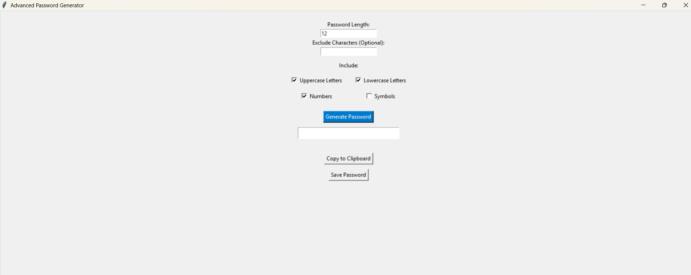
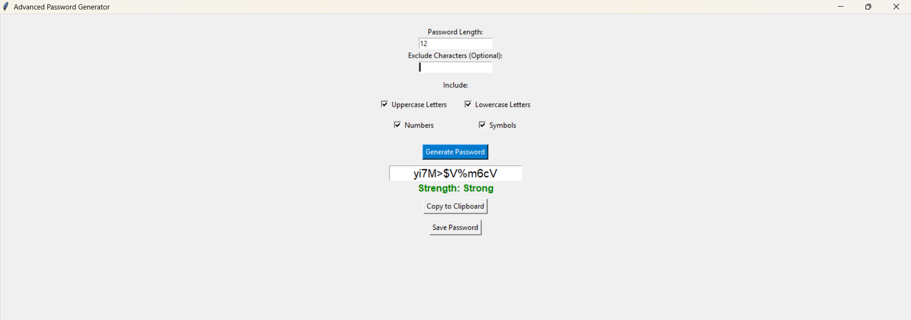

#Project Title
Advanced Password Generator – A GUI-based secure password creation tool using Python and Tkinter

#Description
This is a desktop application built using Python and the Tkinter library. It helps users generate secure, random passwords with several advanced options. Users can customize their passwords by selecting length, choosing which types of characters to include (letters, numbers, symbols), and even excluding specific characters. The app also includes a password strength meter to indicate whether the password is weak, medium, or strong. Additional features include copying the generated password to the clipboard and saving it to a text file. The interface is designed to be simple and user-friendly.

#Features
Generate random passwords
Select password length and character types (letters, numbers, symbols)
Option to exclude specific characters
Password strength indicator (Weak, Medium, Strong)
Copy password to clipboard
Save passwords to a text file
Clean and intuitive GUI

#Screenshots

#Tech Stack
Python
Tkinter

#How to Run
To run the project, make sure you have Python installed, then run the following command in your terminal or command prompt:
bash
Copy
Edit
python advanced_password_generator.py